```python
import pandas as pd
import numpy as np
import matplotlib.pyplot as plt
import seaborn as sns
from mpl_toolkits import mplot3d
%matplotlib inline
```


```python
data=pd.read_csv('Skyserver.csv')
data
```


<div>
<style scoped>
    .dataframe tbody tr th:only-of-type {
        vertical-align: middle;
    }

    .dataframe tbody tr th {
        vertical-align: top;
    }

    .dataframe thead th {
        text-align: right;
    }
</style>
<table border="1" class="dataframe">
  <thead>
    <tr style="text-align: right;">
      <th></th>
      <th>objid</th>
      <th>ra</th>
      <th>dec</th>
      <th>u</th>
      <th>g</th>
      <th>r</th>
      <th>i</th>
      <th>z</th>
      <th>run</th>
      <th>rerun</th>
      <th>camcol</th>
      <th>field</th>
      <th>specobjid</th>
      <th>class</th>
      <th>redshift</th>
      <th>plate</th>
      <th>mjd</th>
      <th>fiberid</th>
    </tr>
  </thead>
  <tbody>
    <tr>
      <th>0</th>
      <td>1.237650e+18</td>
      <td>183.531326</td>
      <td>0.089693</td>
      <td>19.47406</td>
      <td>17.04240</td>
      <td>15.94699</td>
      <td>15.50342</td>
      <td>15.22531</td>
      <td>752</td>
      <td>301</td>
      <td>4</td>
      <td>267</td>
      <td>3.722360e+18</td>
      <td>STAR</td>
      <td>-0.000009</td>
      <td>3306</td>
      <td>54922</td>
      <td>491</td>
    </tr>
    <tr>
      <th>1</th>
      <td>1.237650e+18</td>
      <td>183.598371</td>
      <td>0.135285</td>
      <td>18.66280</td>
      <td>17.21449</td>
      <td>16.67637</td>
      <td>16.48922</td>
      <td>16.39150</td>
      <td>752</td>
      <td>301</td>
      <td>4</td>
      <td>267</td>
      <td>3.638140e+17</td>
      <td>STAR</td>
      <td>-0.000055</td>
      <td>323</td>
      <td>51615</td>
      <td>541</td>
    </tr>
    <tr>
      <th>2</th>
      <td>1.237650e+18</td>
      <td>183.680207</td>
      <td>0.126185</td>
      <td>19.38298</td>
      <td>18.19169</td>
      <td>17.47428</td>
      <td>17.08732</td>
      <td>16.80125</td>
      <td>752</td>
      <td>301</td>
      <td>4</td>
      <td>268</td>
      <td>3.232740e+17</td>
      <td>GALAXY</td>
      <td>0.123111</td>
      <td>287</td>
      <td>52023</td>
      <td>513</td>
    </tr>
    <tr>
      <th>3</th>
      <td>1.237650e+18</td>
      <td>183.870529</td>
      <td>0.049911</td>
      <td>17.76536</td>
      <td>16.60272</td>
      <td>16.16116</td>
      <td>15.98233</td>
      <td>15.90438</td>
      <td>752</td>
      <td>301</td>
      <td>4</td>
      <td>269</td>
      <td>3.722370e+18</td>
      <td>STAR</td>
      <td>-0.000111</td>
      <td>3306</td>
      <td>54922</td>
      <td>510</td>
    </tr>
    <tr>
      <th>4</th>
      <td>1.237650e+18</td>
      <td>183.883288</td>
      <td>0.102557</td>
      <td>17.55025</td>
      <td>16.26342</td>
      <td>16.43869</td>
      <td>16.55492</td>
      <td>16.61326</td>
      <td>752</td>
      <td>301</td>
      <td>4</td>
      <td>269</td>
      <td>3.722370e+18</td>
      <td>STAR</td>
      <td>0.000590</td>
      <td>3306</td>
      <td>54922</td>
      <td>512</td>
    </tr>
    <tr>
      <th>...</th>
      <td>...</td>
      <td>...</td>
      <td>...</td>
      <td>...</td>
      <td>...</td>
      <td>...</td>
      <td>...</td>
      <td>...</td>
      <td>...</td>
      <td>...</td>
      <td>...</td>
      <td>...</td>
      <td>...</td>
      <td>...</td>
      <td>...</td>
      <td>...</td>
      <td>...</td>
      <td>...</td>
    </tr>
    <tr>
      <th>9995</th>
      <td>1.237650e+18</td>
      <td>131.316413</td>
      <td>51.539547</td>
      <td>18.81777</td>
      <td>17.47053</td>
      <td>16.91508</td>
      <td>16.68305</td>
      <td>16.50570</td>
      <td>1345</td>
      <td>301</td>
      <td>3</td>
      <td>161</td>
      <td>5.033450e+17</td>
      <td>GALAXY</td>
      <td>0.027583</td>
      <td>447</td>
      <td>51877</td>
      <td>246</td>
    </tr>
    <tr>
      <th>9996</th>
      <td>1.237650e+18</td>
      <td>131.306083</td>
      <td>51.671341</td>
      <td>18.27255</td>
      <td>17.43849</td>
      <td>17.07692</td>
      <td>16.71661</td>
      <td>16.69897</td>
      <td>1345</td>
      <td>301</td>
      <td>3</td>
      <td>162</td>
      <td>5.033400e+17</td>
      <td>GALAXY</td>
      <td>0.117772</td>
      <td>447</td>
      <td>51877</td>
      <td>228</td>
    </tr>
    <tr>
      <th>9997</th>
      <td>1.237650e+18</td>
      <td>131.552562</td>
      <td>51.666986</td>
      <td>18.75818</td>
      <td>17.77784</td>
      <td>17.51872</td>
      <td>17.43302</td>
      <td>17.42048</td>
      <td>1345</td>
      <td>301</td>
      <td>3</td>
      <td>162</td>
      <td>8.222620e+18</td>
      <td>STAR</td>
      <td>-0.000402</td>
      <td>7303</td>
      <td>57013</td>
      <td>622</td>
    </tr>
    <tr>
      <th>9998</th>
      <td>1.237650e+18</td>
      <td>131.477151</td>
      <td>51.753068</td>
      <td>18.88287</td>
      <td>17.91068</td>
      <td>17.53152</td>
      <td>17.36284</td>
      <td>17.13988</td>
      <td>1345</td>
      <td>301</td>
      <td>3</td>
      <td>163</td>
      <td>5.033400e+17</td>
      <td>GALAXY</td>
      <td>0.014019</td>
      <td>447</td>
      <td>51877</td>
      <td>229</td>
    </tr>
    <tr>
      <th>9999</th>
      <td>1.237650e+18</td>
      <td>131.665012</td>
      <td>51.805307</td>
      <td>19.27586</td>
      <td>17.37829</td>
      <td>16.30542</td>
      <td>15.83548</td>
      <td>15.50588</td>
      <td>1345</td>
      <td>301</td>
      <td>3</td>
      <td>163</td>
      <td>5.033410e+17</td>
      <td>GALAXY</td>
      <td>0.118417</td>
      <td>447</td>
      <td>51877</td>
      <td>233</td>
    </tr>
  </tbody>
</table>
<p>10000 rows × 18 columns</p>
</div>


```python
data.isnull().sum()
```


    objid        0
    ra           0
    dec          0
    u            0
    g            0
    r            0
    i            0
    z            0
    run          0
    rerun        0
    camcol       0
    field        0
    specobjid    0
    class        0
    redshift     0
    plate        0
    mjd          0
    fiberid      0
    dtype: int64


```python
cols=data.columns
for c in cols:
    print(c, len(data[c].unique()))
```

    objid 1
    ra 10000
    dec 10000
    u 9730
    g 9817
    r 9852
    i 9890
    z 9896
    run 23
    rerun 1
    camcol 6
    field 703
    specobjid 6349
    class 3
    redshift 9637
    plate 487
    mjd 355
    fiberid 892


```python
data['objid'].head(10)
```


    0    1.237650e+18
    1    1.237650e+18
    2    1.237650e+18
    3    1.237650e+18
    4    1.237650e+18
    5    1.237650e+18
    6    1.237650e+18
    7    1.237650e+18
    8    1.237650e+18
    9    1.237650e+18
    Name: objid, dtype: float64


```python
data['rerun'].head(10)
```


    0    301
    1    301
    2    301
    3    301
    4    301
    5    301
    6    301
    7    301
    8    301
    9    301
    Name: rerun, dtype: int64


```python
data.drop(['objid','rerun'],axis=1,inplace=True)
```


```python
data
```


<div>
<style scoped>
    .dataframe tbody tr th:only-of-type {
        vertical-align: middle;
    }

    .dataframe tbody tr th {
        vertical-align: top;
    }

    .dataframe thead th {
        text-align: right;
    }
</style>
<table border="1" class="dataframe">
  <thead>
    <tr style="text-align: right;">
      <th></th>
      <th>ra</th>
      <th>dec</th>
      <th>u</th>
      <th>g</th>
      <th>r</th>
      <th>i</th>
      <th>z</th>
      <th>run</th>
      <th>camcol</th>
      <th>field</th>
      <th>specobjid</th>
      <th>class</th>
      <th>redshift</th>
      <th>plate</th>
      <th>mjd</th>
      <th>fiberid</th>
    </tr>
  </thead>
  <tbody>
    <tr>
      <th>0</th>
      <td>183.531326</td>
      <td>0.089693</td>
      <td>19.47406</td>
      <td>17.04240</td>
      <td>15.94699</td>
      <td>15.50342</td>
      <td>15.22531</td>
      <td>752</td>
      <td>4</td>
      <td>267</td>
      <td>3.722360e+18</td>
      <td>STAR</td>
      <td>-0.000009</td>
      <td>3306</td>
      <td>54922</td>
      <td>491</td>
    </tr>
    <tr>
      <th>1</th>
      <td>183.598371</td>
      <td>0.135285</td>
      <td>18.66280</td>
      <td>17.21449</td>
      <td>16.67637</td>
      <td>16.48922</td>
      <td>16.39150</td>
      <td>752</td>
      <td>4</td>
      <td>267</td>
      <td>3.638140e+17</td>
      <td>STAR</td>
      <td>-0.000055</td>
      <td>323</td>
      <td>51615</td>
      <td>541</td>
    </tr>
    <tr>
      <th>2</th>
      <td>183.680207</td>
      <td>0.126185</td>
      <td>19.38298</td>
      <td>18.19169</td>
      <td>17.47428</td>
      <td>17.08732</td>
      <td>16.80125</td>
      <td>752</td>
      <td>4</td>
      <td>268</td>
      <td>3.232740e+17</td>
      <td>GALAXY</td>
      <td>0.123111</td>
      <td>287</td>
      <td>52023</td>
      <td>513</td>
    </tr>
    <tr>
      <th>3</th>
      <td>183.870529</td>
      <td>0.049911</td>
      <td>17.76536</td>
      <td>16.60272</td>
      <td>16.16116</td>
      <td>15.98233</td>
      <td>15.90438</td>
      <td>752</td>
      <td>4</td>
      <td>269</td>
      <td>3.722370e+18</td>
      <td>STAR</td>
      <td>-0.000111</td>
      <td>3306</td>
      <td>54922</td>
      <td>510</td>
    </tr>
    <tr>
      <th>4</th>
      <td>183.883288</td>
      <td>0.102557</td>
      <td>17.55025</td>
      <td>16.26342</td>
      <td>16.43869</td>
      <td>16.55492</td>
      <td>16.61326</td>
      <td>752</td>
      <td>4</td>
      <td>269</td>
      <td>3.722370e+18</td>
      <td>STAR</td>
      <td>0.000590</td>
      <td>3306</td>
      <td>54922</td>
      <td>512</td>
    </tr>
    <tr>
      <th>...</th>
      <td>...</td>
      <td>...</td>
      <td>...</td>
      <td>...</td>
      <td>...</td>
      <td>...</td>
      <td>...</td>
      <td>...</td>
      <td>...</td>
      <td>...</td>
      <td>...</td>
      <td>...</td>
      <td>...</td>
      <td>...</td>
      <td>...</td>
      <td>...</td>
    </tr>
    <tr>
      <th>9995</th>
      <td>131.316413</td>
      <td>51.539547</td>
      <td>18.81777</td>
      <td>17.47053</td>
      <td>16.91508</td>
      <td>16.68305</td>
      <td>16.50570</td>
      <td>1345</td>
      <td>3</td>
      <td>161</td>
      <td>5.033450e+17</td>
      <td>GALAXY</td>
      <td>0.027583</td>
      <td>447</td>
      <td>51877</td>
      <td>246</td>
    </tr>
    <tr>
      <th>9996</th>
      <td>131.306083</td>
      <td>51.671341</td>
      <td>18.27255</td>
      <td>17.43849</td>
      <td>17.07692</td>
      <td>16.71661</td>
      <td>16.69897</td>
      <td>1345</td>
      <td>3</td>
      <td>162</td>
      <td>5.033400e+17</td>
      <td>GALAXY</td>
      <td>0.117772</td>
      <td>447</td>
      <td>51877</td>
      <td>228</td>
    </tr>
    <tr>
      <th>9997</th>
      <td>131.552562</td>
      <td>51.666986</td>
      <td>18.75818</td>
      <td>17.77784</td>
      <td>17.51872</td>
      <td>17.43302</td>
      <td>17.42048</td>
      <td>1345</td>
      <td>3</td>
      <td>162</td>
      <td>8.222620e+18</td>
      <td>STAR</td>
      <td>-0.000402</td>
      <td>7303</td>
      <td>57013</td>
      <td>622</td>
    </tr>
    <tr>
      <th>9998</th>
      <td>131.477151</td>
      <td>51.753068</td>
      <td>18.88287</td>
      <td>17.91068</td>
      <td>17.53152</td>
      <td>17.36284</td>
      <td>17.13988</td>
      <td>1345</td>
      <td>3</td>
      <td>163</td>
      <td>5.033400e+17</td>
      <td>GALAXY</td>
      <td>0.014019</td>
      <td>447</td>
      <td>51877</td>
      <td>229</td>
    </tr>
    <tr>
      <th>9999</th>
      <td>131.665012</td>
      <td>51.805307</td>
      <td>19.27586</td>
      <td>17.37829</td>
      <td>16.30542</td>
      <td>15.83548</td>
      <td>15.50588</td>
      <td>1345</td>
      <td>3</td>
      <td>163</td>
      <td>5.033410e+17</td>
      <td>GALAXY</td>
      <td>0.118417</td>
      <td>447</td>
      <td>51877</td>
      <td>233</td>
    </tr>
  </tbody>
</table>
<p>10000 rows × 16 columns</p>
</div>


```python
data.describe(include='all')
```


<div>
<style scoped>
    .dataframe tbody tr th:only-of-type {
        vertical-align: middle;
    }

    .dataframe tbody tr th {
        vertical-align: top;
    }

    .dataframe thead th {
        text-align: right;
    }
</style>
<table border="1" class="dataframe">
  <thead>
    <tr style="text-align: right;">
      <th></th>
      <th>ra</th>
      <th>dec</th>
      <th>u</th>
      <th>g</th>
      <th>r</th>
      <th>i</th>
      <th>z</th>
      <th>run</th>
      <th>camcol</th>
      <th>field</th>
      <th>specobjid</th>
      <th>class</th>
      <th>redshift</th>
      <th>plate</th>
      <th>mjd</th>
      <th>fiberid</th>
    </tr>
  </thead>
  <tbody>
    <tr>
      <th>count</th>
      <td>10000.000000</td>
      <td>10000.000000</td>
      <td>10000.000000</td>
      <td>10000.000000</td>
      <td>10000.000000</td>
      <td>10000.000000</td>
      <td>10000.000000</td>
      <td>10000.000000</td>
      <td>10000.000000</td>
      <td>10000.000000</td>
      <td>1.000000e+04</td>
      <td>10000</td>
      <td>10000.000000</td>
      <td>10000.000000</td>
      <td>10000.000000</td>
      <td>10000.000000</td>
    </tr>
    <tr>
      <th>unique</th>
      <td>NaN</td>
      <td>NaN</td>
      <td>NaN</td>
      <td>NaN</td>
      <td>NaN</td>
      <td>NaN</td>
      <td>NaN</td>
      <td>NaN</td>
      <td>NaN</td>
      <td>NaN</td>
      <td>NaN</td>
      <td>3</td>
      <td>NaN</td>
      <td>NaN</td>
      <td>NaN</td>
      <td>NaN</td>
    </tr>
    <tr>
      <th>top</th>
      <td>NaN</td>
      <td>NaN</td>
      <td>NaN</td>
      <td>NaN</td>
      <td>NaN</td>
      <td>NaN</td>
      <td>NaN</td>
      <td>NaN</td>
      <td>NaN</td>
      <td>NaN</td>
      <td>NaN</td>
      <td>GALAXY</td>
      <td>NaN</td>
      <td>NaN</td>
      <td>NaN</td>
      <td>NaN</td>
    </tr>
    <tr>
      <th>freq</th>
      <td>NaN</td>
      <td>NaN</td>
      <td>NaN</td>
      <td>NaN</td>
      <td>NaN</td>
      <td>NaN</td>
      <td>NaN</td>
      <td>NaN</td>
      <td>NaN</td>
      <td>NaN</td>
      <td>NaN</td>
      <td>4998</td>
      <td>NaN</td>
      <td>NaN</td>
      <td>NaN</td>
      <td>NaN</td>
    </tr>
    <tr>
      <th>mean</th>
      <td>175.529987</td>
      <td>14.836148</td>
      <td>18.619355</td>
      <td>17.371931</td>
      <td>16.840963</td>
      <td>16.583579</td>
      <td>16.422833</td>
      <td>981.034800</td>
      <td>3.648700</td>
      <td>302.380100</td>
      <td>1.645022e+18</td>
      <td>NaN</td>
      <td>0.143726</td>
      <td>1460.986400</td>
      <td>52943.533300</td>
      <td>353.069400</td>
    </tr>
    <tr>
      <th>std</th>
      <td>47.783439</td>
      <td>25.212207</td>
      <td>0.828656</td>
      <td>0.945457</td>
      <td>1.067764</td>
      <td>1.141805</td>
      <td>1.203188</td>
      <td>273.305024</td>
      <td>1.666183</td>
      <td>162.577763</td>
      <td>2.013998e+18</td>
      <td>NaN</td>
      <td>0.388774</td>
      <td>1788.778371</td>
      <td>1511.150651</td>
      <td>206.298149</td>
    </tr>
    <tr>
      <th>min</th>
      <td>8.235100</td>
      <td>-5.382632</td>
      <td>12.988970</td>
      <td>12.799550</td>
      <td>12.431600</td>
      <td>11.947210</td>
      <td>11.610410</td>
      <td>308.000000</td>
      <td>1.000000</td>
      <td>11.000000</td>
      <td>2.995780e+17</td>
      <td>NaN</td>
      <td>-0.004136</td>
      <td>266.000000</td>
      <td>51578.000000</td>
      <td>1.000000</td>
    </tr>
    <tr>
      <th>25%</th>
      <td>157.370946</td>
      <td>-0.539035</td>
      <td>18.178035</td>
      <td>16.815100</td>
      <td>16.173333</td>
      <td>15.853705</td>
      <td>15.618285</td>
      <td>752.000000</td>
      <td>2.000000</td>
      <td>184.000000</td>
      <td>3.389248e+17</td>
      <td>NaN</td>
      <td>0.000081</td>
      <td>301.000000</td>
      <td>51900.000000</td>
      <td>186.750000</td>
    </tr>
    <tr>
      <th>50%</th>
      <td>180.394514</td>
      <td>0.404166</td>
      <td>18.853095</td>
      <td>17.495135</td>
      <td>16.858770</td>
      <td>16.554985</td>
      <td>16.389945</td>
      <td>756.000000</td>
      <td>4.000000</td>
      <td>299.000000</td>
      <td>4.966580e+17</td>
      <td>NaN</td>
      <td>0.042591</td>
      <td>441.000000</td>
      <td>51997.000000</td>
      <td>351.000000</td>
    </tr>
    <tr>
      <th>75%</th>
      <td>201.547279</td>
      <td>35.649397</td>
      <td>19.259232</td>
      <td>18.010145</td>
      <td>17.512675</td>
      <td>17.258550</td>
      <td>17.141447</td>
      <td>1331.000000</td>
      <td>5.000000</td>
      <td>414.000000</td>
      <td>2.881300e+18</td>
      <td>NaN</td>
      <td>0.092579</td>
      <td>2559.000000</td>
      <td>54468.000000</td>
      <td>510.000000</td>
    </tr>
    <tr>
      <th>max</th>
      <td>260.884382</td>
      <td>68.542265</td>
      <td>19.599900</td>
      <td>19.918970</td>
      <td>24.802040</td>
      <td>28.179630</td>
      <td>22.833060</td>
      <td>1412.000000</td>
      <td>6.000000</td>
      <td>768.000000</td>
      <td>9.468830e+18</td>
      <td>NaN</td>
      <td>5.353854</td>
      <td>8410.000000</td>
      <td>57481.000000</td>
      <td>1000.000000</td>
    </tr>
  </tbody>
</table>
</div>


```python
type(data['specobjid'][0])
```


    numpy.float64


```python
data['specobjid']=data['specobjid']/(10**17)
data['specobjid']
```


    0       37.22360
    1        3.63814
    2        3.23274
    3       37.22370
    4       37.22370
              ...   
    9995     5.03345
    9996     5.03340
    9997    82.22620
    9998     5.03340
    9999     5.03341
    Name: specobjid, Length: 10000, dtype: float64


```python
data.describe(include='all')
```


<div>
<style scoped>
    .dataframe tbody tr th:only-of-type {
        vertical-align: middle;
    }

    .dataframe tbody tr th {
        vertical-align: top;
    }

    .dataframe thead th {
        text-align: right;
    }
</style>
<table border="1" class="dataframe">
  <thead>
    <tr style="text-align: right;">
      <th></th>
      <th>ra</th>
      <th>dec</th>
      <th>u</th>
      <th>g</th>
      <th>r</th>
      <th>i</th>
      <th>z</th>
      <th>run</th>
      <th>camcol</th>
      <th>field</th>
      <th>specobjid</th>
      <th>class</th>
      <th>redshift</th>
      <th>plate</th>
      <th>mjd</th>
      <th>fiberid</th>
    </tr>
  </thead>
  <tbody>
    <tr>
      <th>count</th>
      <td>10000.000000</td>
      <td>10000.000000</td>
      <td>10000.000000</td>
      <td>10000.000000</td>
      <td>10000.000000</td>
      <td>10000.000000</td>
      <td>10000.000000</td>
      <td>10000.000000</td>
      <td>10000.000000</td>
      <td>10000.000000</td>
      <td>10000.000000</td>
      <td>10000</td>
      <td>10000.000000</td>
      <td>10000.000000</td>
      <td>10000.000000</td>
      <td>10000.000000</td>
    </tr>
    <tr>
      <th>unique</th>
      <td>NaN</td>
      <td>NaN</td>
      <td>NaN</td>
      <td>NaN</td>
      <td>NaN</td>
      <td>NaN</td>
      <td>NaN</td>
      <td>NaN</td>
      <td>NaN</td>
      <td>NaN</td>
      <td>NaN</td>
      <td>3</td>
      <td>NaN</td>
      <td>NaN</td>
      <td>NaN</td>
      <td>NaN</td>
    </tr>
    <tr>
      <th>top</th>
      <td>NaN</td>
      <td>NaN</td>
      <td>NaN</td>
      <td>NaN</td>
      <td>NaN</td>
      <td>NaN</td>
      <td>NaN</td>
      <td>NaN</td>
      <td>NaN</td>
      <td>NaN</td>
      <td>NaN</td>
      <td>GALAXY</td>
      <td>NaN</td>
      <td>NaN</td>
      <td>NaN</td>
      <td>NaN</td>
    </tr>
    <tr>
      <th>freq</th>
      <td>NaN</td>
      <td>NaN</td>
      <td>NaN</td>
      <td>NaN</td>
      <td>NaN</td>
      <td>NaN</td>
      <td>NaN</td>
      <td>NaN</td>
      <td>NaN</td>
      <td>NaN</td>
      <td>NaN</td>
      <td>4998</td>
      <td>NaN</td>
      <td>NaN</td>
      <td>NaN</td>
      <td>NaN</td>
    </tr>
    <tr>
      <th>mean</th>
      <td>175.529987</td>
      <td>14.836148</td>
      <td>18.619355</td>
      <td>17.371931</td>
      <td>16.840963</td>
      <td>16.583579</td>
      <td>16.422833</td>
      <td>981.034800</td>
      <td>3.648700</td>
      <td>302.380100</td>
      <td>16.450216</td>
      <td>NaN</td>
      <td>0.143726</td>
      <td>1460.986400</td>
      <td>52943.533300</td>
      <td>353.069400</td>
    </tr>
    <tr>
      <th>std</th>
      <td>47.783439</td>
      <td>25.212207</td>
      <td>0.828656</td>
      <td>0.945457</td>
      <td>1.067764</td>
      <td>1.141805</td>
      <td>1.203188</td>
      <td>273.305024</td>
      <td>1.666183</td>
      <td>162.577763</td>
      <td>20.139985</td>
      <td>NaN</td>
      <td>0.388774</td>
      <td>1788.778371</td>
      <td>1511.150651</td>
      <td>206.298149</td>
    </tr>
    <tr>
      <th>min</th>
      <td>8.235100</td>
      <td>-5.382632</td>
      <td>12.988970</td>
      <td>12.799550</td>
      <td>12.431600</td>
      <td>11.947210</td>
      <td>11.610410</td>
      <td>308.000000</td>
      <td>1.000000</td>
      <td>11.000000</td>
      <td>2.995780</td>
      <td>NaN</td>
      <td>-0.004136</td>
      <td>266.000000</td>
      <td>51578.000000</td>
      <td>1.000000</td>
    </tr>
    <tr>
      <th>25%</th>
      <td>157.370946</td>
      <td>-0.539035</td>
      <td>18.178035</td>
      <td>16.815100</td>
      <td>16.173333</td>
      <td>15.853705</td>
      <td>15.618285</td>
      <td>752.000000</td>
      <td>2.000000</td>
      <td>184.000000</td>
      <td>3.389247</td>
      <td>NaN</td>
      <td>0.000081</td>
      <td>301.000000</td>
      <td>51900.000000</td>
      <td>186.750000</td>
    </tr>
    <tr>
      <th>50%</th>
      <td>180.394514</td>
      <td>0.404166</td>
      <td>18.853095</td>
      <td>17.495135</td>
      <td>16.858770</td>
      <td>16.554985</td>
      <td>16.389945</td>
      <td>756.000000</td>
      <td>4.000000</td>
      <td>299.000000</td>
      <td>4.966580</td>
      <td>NaN</td>
      <td>0.042591</td>
      <td>441.000000</td>
      <td>51997.000000</td>
      <td>351.000000</td>
    </tr>
    <tr>
      <th>75%</th>
      <td>201.547279</td>
      <td>35.649397</td>
      <td>19.259232</td>
      <td>18.010145</td>
      <td>17.512675</td>
      <td>17.258550</td>
      <td>17.141447</td>
      <td>1331.000000</td>
      <td>5.000000</td>
      <td>414.000000</td>
      <td>28.813000</td>
      <td>NaN</td>
      <td>0.092579</td>
      <td>2559.000000</td>
      <td>54468.000000</td>
      <td>510.000000</td>
    </tr>
    <tr>
      <th>max</th>
      <td>260.884382</td>
      <td>68.542265</td>
      <td>19.599900</td>
      <td>19.918970</td>
      <td>24.802040</td>
      <td>28.179630</td>
      <td>22.833060</td>
      <td>1412.000000</td>
      <td>6.000000</td>
      <td>768.000000</td>
      <td>94.688300</td>
      <td>NaN</td>
      <td>5.353854</td>
      <td>8410.000000</td>
      <td>57481.000000</td>
      <td>1000.000000</td>
    </tr>
  </tbody>
</table>
</div>


```python
cols=data.columns
for c in cols:
    print(c, len(data[c].unique()))
```

    ra 10000
    dec 10000
    u 9730
    g 9817
    r 9852
    i 9890
    z 9896
    run 23
    camcol 6
    field 703
    specobjid 6349
    class 3
    redshift 9637
    plate 487
    mjd 355
    fiberid 892


```python
sns.set()
```


```python
from sklearn.preprocessing import LabelEncoder
le=LabelEncoder()
data['class']=le.fit_transform(data['class'])
```


```python
sns.pairplot(data[['u','g','r','i','z','class']])
plt.show()
```


    
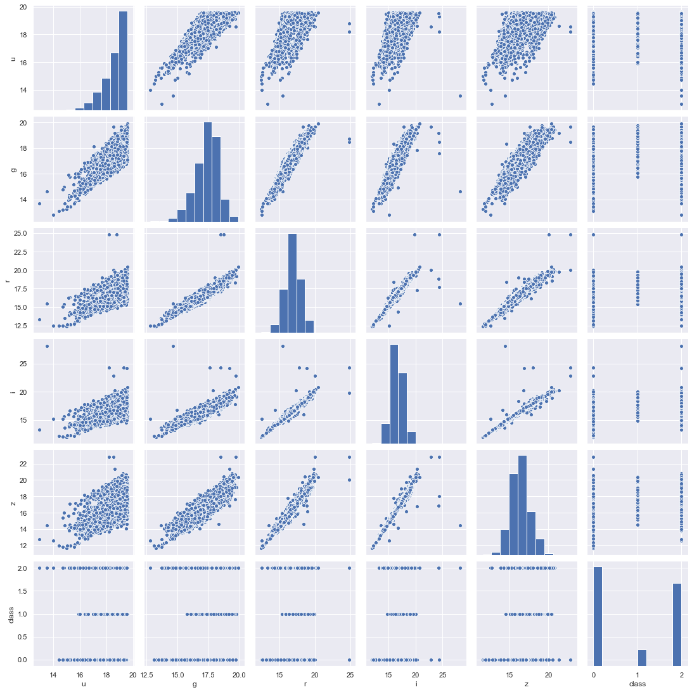
    


```python
sns.scatterplot(data['ra'],data['dec'],hue=data['class'])
plt.show()
```


    
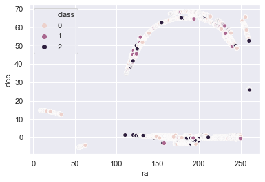
    


#### Angular position from earth has nothing to do with the stars classification.


```python
sns.scatterplot(data['u'],data['redshift'],hue=data['class'])
plt.show()
```


    
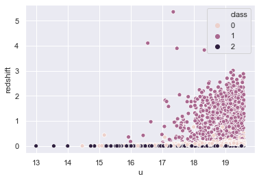
    


```python
sns.scatterplot(data['u'],data['z'],hue=data['class'])
plt.show()
```


    
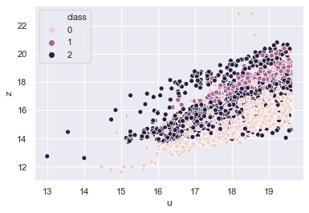
    


```python
sns.scatterplot(data['u'],data['i'],hue=data['class'])
plt.show()
```


    
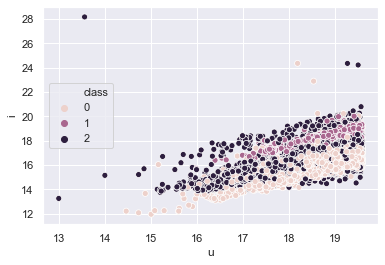
    


```python
data['uz']=data['u']*data['z']
```


```python
sns.scatterplot(data['redshift'],data['uz'],hue=data['class'])
plt.show()
```


    
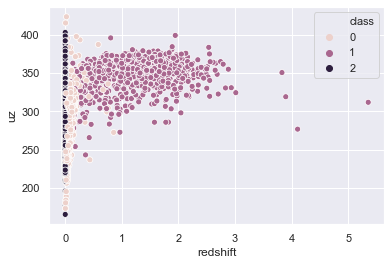
    


```python
data['u/z']=data['u']/data['z']
```


```python
sns.scatterplot(data['redshift'],data['u/z'],hue=data['class'])
plt.show()
```


    
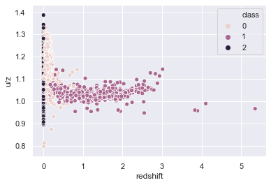
    


```python
sns.scatterplot(data['u/z'],data['uz'],hue=data['class'])
plt.show()
```


    
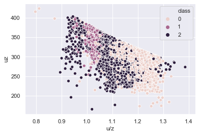
    


```python

```


```python
a=data['u']-data['z']
b=data['u']*data['z']
sns.scatterplot(a,b,hue=data['class'])
plt.show()
```


    
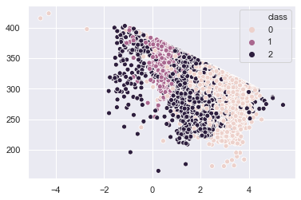
    


```python
sns.scatterplot(a,data['class'],hue=data['class'])
plt.show()
```


    
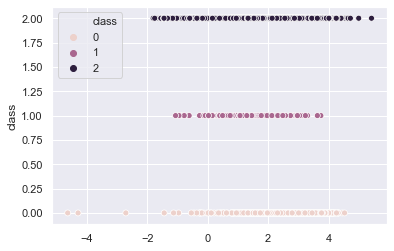
    


```python
ax = plt.axes(projection='3d')
ax.scatter(data['u'],data['z'], data['redshift'], c=data['class'],  linewidth=0.5);
plt.show()
```


    
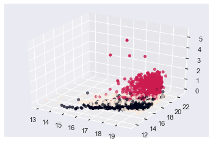
    


```python
ax = plt.axes(projection='3d')
ax.scatter(data['u'],data['z'], data['g'], c=data['class'], linewidth=0.5);
plt.show()
```


    
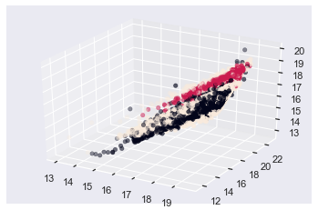
    


```python
fig=plt.figure()
alpha=fig.add_subplot(111, projection = '3d')
alpha.scatter(a,b,data['redshift'],c=data['class'])
plt.show()
```


    
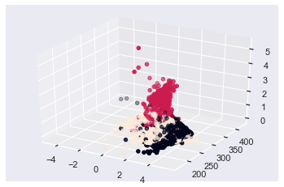
    


```python
useful=data[['u','g','r','i','z','redshift','class']]
```


```python
useful
```


<div>
<style scoped>
    .dataframe tbody tr th:only-of-type {
        vertical-align: middle;
    }

    .dataframe tbody tr th {
        vertical-align: top;
    }

    .dataframe thead th {
        text-align: right;
    }
</style>
<table border="1" class="dataframe">
  <thead>
    <tr style="text-align: right;">
      <th></th>
      <th>u</th>
      <th>g</th>
      <th>r</th>
      <th>i</th>
      <th>z</th>
      <th>redshift</th>
      <th>class</th>
    </tr>
  </thead>
  <tbody>
    <tr>
      <th>0</th>
      <td>19.47406</td>
      <td>17.04240</td>
      <td>15.94699</td>
      <td>15.50342</td>
      <td>15.22531</td>
      <td>-0.000009</td>
      <td>2</td>
    </tr>
    <tr>
      <th>1</th>
      <td>18.66280</td>
      <td>17.21449</td>
      <td>16.67637</td>
      <td>16.48922</td>
      <td>16.39150</td>
      <td>-0.000055</td>
      <td>2</td>
    </tr>
    <tr>
      <th>2</th>
      <td>19.38298</td>
      <td>18.19169</td>
      <td>17.47428</td>
      <td>17.08732</td>
      <td>16.80125</td>
      <td>0.123111</td>
      <td>0</td>
    </tr>
    <tr>
      <th>3</th>
      <td>17.76536</td>
      <td>16.60272</td>
      <td>16.16116</td>
      <td>15.98233</td>
      <td>15.90438</td>
      <td>-0.000111</td>
      <td>2</td>
    </tr>
    <tr>
      <th>4</th>
      <td>17.55025</td>
      <td>16.26342</td>
      <td>16.43869</td>
      <td>16.55492</td>
      <td>16.61326</td>
      <td>0.000590</td>
      <td>2</td>
    </tr>
    <tr>
      <th>...</th>
      <td>...</td>
      <td>...</td>
      <td>...</td>
      <td>...</td>
      <td>...</td>
      <td>...</td>
      <td>...</td>
    </tr>
    <tr>
      <th>9995</th>
      <td>18.81777</td>
      <td>17.47053</td>
      <td>16.91508</td>
      <td>16.68305</td>
      <td>16.50570</td>
      <td>0.027583</td>
      <td>0</td>
    </tr>
    <tr>
      <th>9996</th>
      <td>18.27255</td>
      <td>17.43849</td>
      <td>17.07692</td>
      <td>16.71661</td>
      <td>16.69897</td>
      <td>0.117772</td>
      <td>0</td>
    </tr>
    <tr>
      <th>9997</th>
      <td>18.75818</td>
      <td>17.77784</td>
      <td>17.51872</td>
      <td>17.43302</td>
      <td>17.42048</td>
      <td>-0.000402</td>
      <td>2</td>
    </tr>
    <tr>
      <th>9998</th>
      <td>18.88287</td>
      <td>17.91068</td>
      <td>17.53152</td>
      <td>17.36284</td>
      <td>17.13988</td>
      <td>0.014019</td>
      <td>0</td>
    </tr>
    <tr>
      <th>9999</th>
      <td>19.27586</td>
      <td>17.37829</td>
      <td>16.30542</td>
      <td>15.83548</td>
      <td>15.50588</td>
      <td>0.118417</td>
      <td>0</td>
    </tr>
  </tbody>
</table>
<p>10000 rows × 7 columns</p>
</div>


```python
useful=data[['u','g','r','i','z','redshift','class']]
y=useful['class']
x=useful.drop(['class'],axis=1)
```


```python
y.head()
```


    0    2
    1    2
    2    0
    3    2
    4    2
    Name: class, dtype: int32


```python
x.head()
```


<div>
<style scoped>
    .dataframe tbody tr th:only-of-type {
        vertical-align: middle;
    }

    .dataframe tbody tr th {
        vertical-align: top;
    }

    .dataframe thead th {
        text-align: right;
    }
</style>
<table border="1" class="dataframe">
  <thead>
    <tr style="text-align: right;">
      <th></th>
      <th>u</th>
      <th>g</th>
      <th>r</th>
      <th>i</th>
      <th>z</th>
      <th>redshift</th>
    </tr>
  </thead>
  <tbody>
    <tr>
      <th>0</th>
      <td>19.47406</td>
      <td>17.04240</td>
      <td>15.94699</td>
      <td>15.50342</td>
      <td>15.22531</td>
      <td>-0.000009</td>
    </tr>
    <tr>
      <th>1</th>
      <td>18.66280</td>
      <td>17.21449</td>
      <td>16.67637</td>
      <td>16.48922</td>
      <td>16.39150</td>
      <td>-0.000055</td>
    </tr>
    <tr>
      <th>2</th>
      <td>19.38298</td>
      <td>18.19169</td>
      <td>17.47428</td>
      <td>17.08732</td>
      <td>16.80125</td>
      <td>0.123111</td>
    </tr>
    <tr>
      <th>3</th>
      <td>17.76536</td>
      <td>16.60272</td>
      <td>16.16116</td>
      <td>15.98233</td>
      <td>15.90438</td>
      <td>-0.000111</td>
    </tr>
    <tr>
      <th>4</th>
      <td>17.55025</td>
      <td>16.26342</td>
      <td>16.43869</td>
      <td>16.55492</td>
      <td>16.61326</td>
      <td>0.000590</td>
    </tr>
  </tbody>
</table>
</div>


```python
x.skew()
```


    u          -1.219795
    g          -0.536293
    r          -0.021673
    i           0.286442
    z           0.214313
    redshift    4.265729
    dtype: float64


#### It is better not to treat this skewness as the radiating radiating very highly on ultraviolet band has a different mechanism of irridiance: a very useful information to it's classification. Also not all celestial objects are moving relative to earth and hence relative to each other(expanding bubble like universe model)with very high velocity, so we are keeping redshift untreated for skewness.


```python
from sklearn.preprocessing import StandardScaler
ss=StandardScaler()
ss.fit_transform(x)
```


    array([[ 1.03148637, -0.34855938, -0.83728027, -0.94605772, -0.99534154,
            -0.36973112],
           [ 0.05243046, -0.16653251, -0.15415531, -0.08264457, -0.02604308,
            -0.36984929],
           [ 0.92156796,  0.86709322,  0.59315368,  0.44120145,  0.31452753,
            -0.05302706],
           ...,
           [ 0.16753826,  0.42934659,  0.63477543,  0.74398287,  0.82921097,
            -0.37074104],
           [ 0.31801835,  0.56985707,  0.64676369,  0.6825157 ,  0.59598555,
            -0.33364691],
           [ 0.79229193,  0.00672567, -0.5015808 , -0.65522289, -0.76214106,
            -0.06510125]])


```python
from sklearn.model_selection import train_test_split
X_train,X_test,y_train,y_test=train_test_split(x,y,test_size=0.20)
```


```python
from sklearn.linear_model import LogisticRegression
from sklearn.metrics import classification_report,confusion_matrix
```


```python
lr=LogisticRegression(max_iter=1000)
lr.fit(X_train,y_train)
print(lr.score(X_test,y_test))
print(confusion_matrix(lr.predict(X_test),y_test))
print(classification_report(lr.predict(X_test),y_test))
```

    0.9575
    [[928  12  13]
     [  4 164   1]
     [ 55   0 823]]
                  precision    recall  f1-score   support
    
               0       0.94      0.97      0.96       953
               1       0.93      0.97      0.95       169
               2       0.98      0.94      0.96       878
    
        accuracy                           0.96      2000
       macro avg       0.95      0.96      0.96      2000
    weighted avg       0.96      0.96      0.96      2000
    


```python
from sklearn.model_selection import cross_val_score
scores = cross_val_score(lr, x, y, cv=5)
scores
```


    array([0.9575, 0.9615, 0.962 , 0.9535, 0.9575])


```python
scores.mean()
```


    0.9583999999999999


```python
data.describe()
```


<div>
<style scoped>
    .dataframe tbody tr th:only-of-type {
        vertical-align: middle;
    }

    .dataframe tbody tr th {
        vertical-align: top;
    }

    .dataframe thead th {
        text-align: right;
    }
</style>
<table border="1" class="dataframe">
  <thead>
    <tr style="text-align: right;">
      <th></th>
      <th>ra</th>
      <th>dec</th>
      <th>u</th>
      <th>g</th>
      <th>r</th>
      <th>i</th>
      <th>z</th>
      <th>run</th>
      <th>camcol</th>
      <th>field</th>
      <th>specobjid</th>
      <th>class</th>
      <th>redshift</th>
      <th>plate</th>
      <th>mjd</th>
      <th>fiberid</th>
      <th>uz</th>
      <th>u/z</th>
    </tr>
  </thead>
  <tbody>
    <tr>
      <th>count</th>
      <td>10000.000000</td>
      <td>10000.000000</td>
      <td>10000.000000</td>
      <td>10000.000000</td>
      <td>10000.000000</td>
      <td>10000.000000</td>
      <td>10000.000000</td>
      <td>10000.000000</td>
      <td>10000.000000</td>
      <td>10000.000000</td>
      <td>10000.000000</td>
      <td>10000.000000</td>
      <td>10000.000000</td>
      <td>10000.000000</td>
      <td>10000.000000</td>
      <td>10000.000000</td>
      <td>10000.000000</td>
      <td>10000.000000</td>
    </tr>
    <tr>
      <th>mean</th>
      <td>175.529987</td>
      <td>14.836148</td>
      <td>18.619355</td>
      <td>17.371931</td>
      <td>16.840963</td>
      <td>16.583579</td>
      <td>16.422833</td>
      <td>981.034800</td>
      <td>3.648700</td>
      <td>302.380100</td>
      <td>16.450216</td>
      <td>0.915400</td>
      <td>0.143726</td>
      <td>1460.986400</td>
      <td>52943.533300</td>
      <td>353.069400</td>
      <td>306.332356</td>
      <td>1.137683</td>
    </tr>
    <tr>
      <th>std</th>
      <td>47.783439</td>
      <td>25.212207</td>
      <td>0.828656</td>
      <td>0.945457</td>
      <td>1.067764</td>
      <td>1.141805</td>
      <td>1.203188</td>
      <td>273.305024</td>
      <td>1.666183</td>
      <td>162.577763</td>
      <td>20.139985</td>
      <td>0.952856</td>
      <td>0.388774</td>
      <td>1788.778371</td>
      <td>1511.150651</td>
      <td>206.298149</td>
      <td>31.506514</td>
      <td>0.068142</td>
    </tr>
    <tr>
      <th>min</th>
      <td>8.235100</td>
      <td>-5.382632</td>
      <td>12.988970</td>
      <td>12.799550</td>
      <td>12.431600</td>
      <td>11.947210</td>
      <td>11.610410</td>
      <td>308.000000</td>
      <td>1.000000</td>
      <td>11.000000</td>
      <td>2.995780</td>
      <td>0.000000</td>
      <td>-0.004136</td>
      <td>266.000000</td>
      <td>51578.000000</td>
      <td>1.000000</td>
      <td>165.426223</td>
      <td>0.796948</td>
    </tr>
    <tr>
      <th>25%</th>
      <td>157.370946</td>
      <td>-0.539035</td>
      <td>18.178035</td>
      <td>16.815100</td>
      <td>16.173333</td>
      <td>15.853705</td>
      <td>15.618285</td>
      <td>752.000000</td>
      <td>2.000000</td>
      <td>184.000000</td>
      <td>3.389247</td>
      <td>0.000000</td>
      <td>0.000081</td>
      <td>301.000000</td>
      <td>51900.000000</td>
      <td>186.750000</td>
      <td>287.294239</td>
      <td>1.090406</td>
    </tr>
    <tr>
      <th>50%</th>
      <td>180.394514</td>
      <td>0.404166</td>
      <td>18.853095</td>
      <td>17.495135</td>
      <td>16.858770</td>
      <td>16.554985</td>
      <td>16.389945</td>
      <td>756.000000</td>
      <td>4.000000</td>
      <td>299.000000</td>
      <td>4.966580</td>
      <td>1.000000</td>
      <td>0.042591</td>
      <td>441.000000</td>
      <td>51997.000000</td>
      <td>351.000000</td>
      <td>308.636727</td>
      <td>1.137168</td>
    </tr>
    <tr>
      <th>75%</th>
      <td>201.547279</td>
      <td>35.649397</td>
      <td>19.259232</td>
      <td>18.010145</td>
      <td>17.512675</td>
      <td>17.258550</td>
      <td>17.141447</td>
      <td>1331.000000</td>
      <td>5.000000</td>
      <td>414.000000</td>
      <td>28.813000</td>
      <td>2.000000</td>
      <td>0.092579</td>
      <td>2559.000000</td>
      <td>54468.000000</td>
      <td>510.000000</td>
      <td>327.099275</td>
      <td>1.183902</td>
    </tr>
    <tr>
      <th>max</th>
      <td>260.884382</td>
      <td>68.542265</td>
      <td>19.599900</td>
      <td>19.918970</td>
      <td>24.802040</td>
      <td>28.179630</td>
      <td>22.833060</td>
      <td>1412.000000</td>
      <td>6.000000</td>
      <td>768.000000</td>
      <td>94.688300</td>
      <td>2.000000</td>
      <td>5.353854</td>
      <td>8410.000000</td>
      <td>57481.000000</td>
      <td>1000.000000</td>
      <td>423.339089</td>
      <td>1.386132</td>
    </tr>
  </tbody>
</table>
</div>


```python
sns.pairplot(data[['run','camcol','field','class']])
plt.show()
```


    
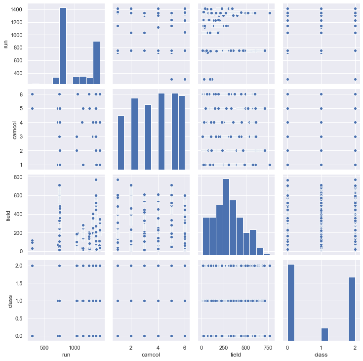
    


```python
data[['run','camcol','field','class']].corr()
```


<div>
<style scoped>
    .dataframe tbody tr th:only-of-type {
        vertical-align: middle;
    }

    .dataframe tbody tr th {
        vertical-align: top;
    }

    .dataframe thead th {
        text-align: right;
    }
</style>
<table border="1" class="dataframe">
  <thead>
    <tr style="text-align: right;">
      <th></th>
      <th>run</th>
      <th>camcol</th>
      <th>field</th>
      <th>class</th>
    </tr>
  </thead>
  <tbody>
    <tr>
      <th>run</th>
      <td>1.000000</td>
      <td>0.151814</td>
      <td>-0.463898</td>
      <td>-0.078162</td>
    </tr>
    <tr>
      <th>camcol</th>
      <td>0.151814</td>
      <td>1.000000</td>
      <td>-0.067921</td>
      <td>-0.006186</td>
    </tr>
    <tr>
      <th>field</th>
      <td>-0.463898</td>
      <td>-0.067921</td>
      <td>1.000000</td>
      <td>0.007713</td>
    </tr>
    <tr>
      <th>class</th>
      <td>-0.078162</td>
      <td>-0.006186</td>
      <td>0.007713</td>
      <td>1.000000</td>
    </tr>
  </tbody>
</table>
</div>


#### As run,camcol and field are related to the mechanism of discovery and not to the nature of the object itself they have almost zero correlation with the target variable.


```python
independent=data[['u','g','r','i','z','uz','u/z']]
```


```python
dependent=data['class']
```


```python
independent=ss.fit_transform(independent)
```


```python
independent
```


    array([[ 1.03148637, -0.34855938, -0.83728027, ..., -0.99534154,
            -0.31213378,  2.07481773],
           [ 0.05243046, -0.16653251, -0.15415531, ..., -0.02604308,
            -0.0133652 ,  0.01295585],
           [ 0.92156796,  0.86709322,  0.59315368, ...,  0.31452753,
             0.61342563,  0.23452225],
           ...,
           [ 0.16753826,  0.42934659,  0.63477543, ...,  0.82921097,
             0.64891869, -0.89367678],
           [ 0.31801835,  0.56985707,  0.64676369, ...,  0.59598555,
             0.54968429, -0.52819961],
           [ 0.79229193,  0.00672567, -0.5015808 , ..., -0.76214106,
            -0.23625451,  1.54756872]])


```python
X_train,X_test,y_train,y_test=train_test_split(x,y,test_size=0.20)
```


```python
lr.fit(X_train,y_train)
print(lr.score(X_test,y_test))
print(confusion_matrix(lr.predict(X_test),y_test))
print(classification_report(lr.predict(X_test),y_test))
```

    0.957
    [[961  13   9]
     [  7 155   0]
     [ 57   0 798]]
                  precision    recall  f1-score   support
    
               0       0.94      0.98      0.96       983
               1       0.92      0.96      0.94       162
               2       0.99      0.93      0.96       855
    
        accuracy                           0.96      2000
       macro avg       0.95      0.96      0.95      2000
    weighted avg       0.96      0.96      0.96      2000
    


```python
from sklearn.tree import DecisionTreeClassifier
tree=DecisionTreeClassifier()
from sklearn.naive_bayes import GaussianNB
nb=GaussianNB()
from sklearn.neighbors import KNeighborsClassifier
knc=KNeighborsClassifier()
from sklearn.neural_network import MLPClassifier
nn=MLPClassifier(hidden_layer_sizes=(36,6),max_iter=1000)

```


```python
models=[lr,tree,nb,knc,nn]
for model in models:
    model.fit(X_train,y_train)
    print('---'*30,'\n',model,'\n','---'*30)
    print(model.score(X_test,y_test))
    print(confusion_matrix(model.predict(X_test),y_test))
    print(classification_report(model.predict(X_test),y_test))
```

    ------------------------------------------------------------------------------------------ 
     LogisticRegression(C=1.0, class_weight=None, dual=False, fit_intercept=True,
                       intercept_scaling=1, l1_ratio=None, max_iter=1000,
                       multi_class='auto', n_jobs=None, penalty='l2',
                       random_state=None, solver='lbfgs', tol=0.0001, verbose=0,
                       warm_start=False) 
     ------------------------------------------------------------------------------------------
    0.957
    [[961  13   9]
     [  7 155   0]
     [ 57   0 798]]
                  precision    recall  f1-score   support
    
               0       0.94      0.98      0.96       983
               1       0.92      0.96      0.94       162
               2       0.99      0.93      0.96       855
    
        accuracy                           0.96      2000
       macro avg       0.95      0.96      0.95      2000
    weighted avg       0.96      0.96      0.96      2000
    
    ------------------------------------------------------------------------------------------ 
     DecisionTreeClassifier(ccp_alpha=0.0, class_weight=None, criterion='gini',
                           max_depth=None, max_features=None, max_leaf_nodes=None,
                           min_impurity_decrease=0.0, min_impurity_split=None,
                           min_samples_leaf=1, min_samples_split=2,
                           min_weight_fraction_leaf=0.0, presort='deprecated',
                           random_state=None, splitter='best') 
     ------------------------------------------------------------------------------------------
    0.9865
    [[1010   12    0]
     [  12  156    0]
     [   3    0  807]]
                  precision    recall  f1-score   support
    
               0       0.99      0.99      0.99      1022
               1       0.93      0.93      0.93       168
               2       1.00      1.00      1.00       810
    
        accuracy                           0.99      2000
       macro avg       0.97      0.97      0.97      2000
    weighted avg       0.99      0.99      0.99      2000
    
    ------------------------------------------------------------------------------------------ 
     GaussianNB(priors=None, var_smoothing=1e-09) 
     ------------------------------------------------------------------------------------------
    0.981
    [[1002   10    4]
     [  14  158    1]
     [   9    0  802]]
                  precision    recall  f1-score   support
    
               0       0.98      0.99      0.98      1016
               1       0.94      0.91      0.93       173
               2       0.99      0.99      0.99       811
    
        accuracy                           0.98      2000
       macro avg       0.97      0.96      0.97      2000
    weighted avg       0.98      0.98      0.98      2000
    
    ------------------------------------------------------------------------------------------ 
     KNeighborsClassifier(algorithm='auto', leaf_size=30, metric='minkowski',
                         metric_params=None, n_jobs=None, n_neighbors=5, p=2,
                         weights='uniform') 
     ------------------------------------------------------------------------------------------
    0.9485
    [[950  10  15]
     [  5 157   2]
     [ 70   1 790]]
                  precision    recall  f1-score   support
    
               0       0.93      0.97      0.95       975
               1       0.93      0.96      0.95       164
               2       0.98      0.92      0.95       861
    
        accuracy                           0.95      2000
       macro avg       0.95      0.95      0.95      2000
    weighted avg       0.95      0.95      0.95      2000
    
    ------------------------------------------------------------------------------------------ 
     MLPClassifier(activation='relu', alpha=0.0001, batch_size='auto', beta_1=0.9,
                  beta_2=0.999, early_stopping=False, epsilon=1e-08,
                  hidden_layer_sizes=(36, 6), learning_rate='constant',
                  learning_rate_init=0.001, max_fun=15000, max_iter=1000,
                  momentum=0.9, n_iter_no_change=10, nesterovs_momentum=True,
                  power_t=0.5, random_state=None, shuffle=True, solver='adam',
                  tol=0.0001, validation_fraction=0.1, verbose=False,
                  warm_start=False) 
     ------------------------------------------------------------------------------------------
    0.9795
    [[999  13   2]
     [  6 155   0]
     [ 20   0 805]]
                  precision    recall  f1-score   support
    
               0       0.97      0.99      0.98      1014
               1       0.92      0.96      0.94       161
               2       1.00      0.98      0.99       825
    
        accuracy                           0.98      2000
       macro avg       0.96      0.97      0.97      2000
    weighted avg       0.98      0.98      0.98      2000
    


```python
print(cross_val_score(tree,x,y,cv=5))
print(cross_val_score(nn,x,y,cv=5))
```

    [0.9875 0.987  0.988  0.984  0.9875]
    [0.9835 0.985  0.985  0.975  0.979 ]


#### Clearly Decission tree has slight but percistant advantage


```python
from sklearn.externals import joblib
joblib.dump(tree,'space.pkl')
```

    C:\ProgramData\Anaconda3\lib\site-packages\sklearn\externals\joblib\__init__.py:15: FutureWarning: sklearn.externals.joblib is deprecated in 0.21 and will be removed in 0.23. Please import this functionality directly from joblib, which can be installed with: pip install joblib. If this warning is raised when loading pickled models, you may need to re-serialize those models with scikit-learn 0.21+.
      warnings.warn(msg, category=FutureWarning)


    ['space.pkl']


```python
result=tree.predict(X_test)
```


```python
output=pd.DataFrame(result)
output.to_csv('output.csv')
```


```python
sns.set()
```


```python
fig=plt.figure()
alpha=fig.add_subplot(111, projection = '3d')
alpha.scatter(data['redshift'],data['i'],data['u'],c=data['class'])
plt.show()
```


    
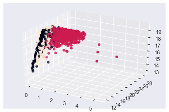
    


```python
le.classes_
```


    array(['GALAXY', 'QSO', 'STAR'], dtype=object)


```python
data.drop('class',axis=1).corrwith(data['class']).plot(kind='bar')
plt.show()
```


    
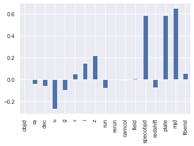
    


```python
fig=plt.figure()
alpha=fig.add_subplot(111, projection = '3d')
alpha.scatter(data['specobjid'],data['plate'],data['mjd'],c=data['class'])
plt.show()
```


    
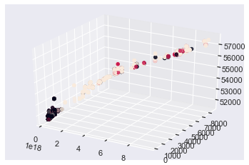
    


```python

```
